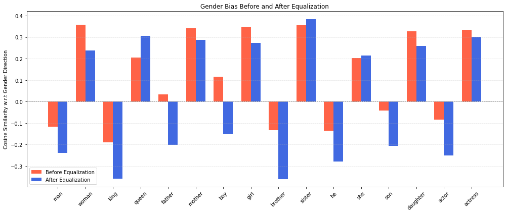

# 🧠 Debiasing Word Embeddings with GloVe

A hands-on implementation of techniques to detect and reduce **gender bias** in word embeddings using GloVe vectors. Inspired by the research paper _“Man is to Computer Programmer as Woman is to Homemaker? Debiasing Word Embeddings”_ by Bolukbasi et al. (2016), this project showcases how bias creeps into machine learning models, and how we can fix it.

---

## Project Overview

In this notebook, we explore and correct bias in pretrained word vectors using the following steps:

- Perform **analogy tasks** to highlight biased relationships (e.g., `man : doctor :: woman : ?`)
- Apply **neutralization** to remove gender direction from gender-neutral words  
- Apply **equalization** to make gender-specific pairs like `king/queen`, `he/she` symmetrically aligned  
- Visualize before-and-after results using **bar plots**

---

## Project Structure

```bash
debiasing-word-embeddings/
├── images/
│   ├── equalize10.png               # Visual illustration of equalization
│   ├── neutral.png                  # Diagram explaining neutralization
│   ├── neutralize.png               # Conceptual visualization of neutral vector
│   └── gen_bar_plot.png             # Bar plot comparing cosine similarities
│
├── notebook.ipynb # Main Jupyter Notebook with full implementation
```
---


---

## Key Techniques Implemented

| Technique        | Description |
|------------------|-------------|
| `cosine_similarity()` | Measures directional bias of word vectors |
| `neutralize()`         | Removes bias from gender-neutral words |
| `equalize()`           | Symmetrically aligns gendered word pairs |
| `Analogy Solver`       | Checks how bias affects predictions in analogy tasks |

---

---

## Visual Illustrations

To help understand how debiasing works, here are some visual explanations of the concepts applied:

### Neutralization

This process removes gender components from gender-neutral words so their embeddings lie orthogonal to the gender direction.


---

### Equalization

Equalization aligns gender-specific word pairs (e.g., `man/woman`, `king/queen`) such that they are **equidistant** from the gender axis.


---


## Visualization: Bias in Gendered Word Pairs

The plot below displays the cosine similarity of several gendered word pairs (e.g., `man/woman`, `king/queen`, `he/she`) with the gender direction vector, both **before** and **after** applying the **equalization algorithm**.

This clearly illustrates how equalization balances the representation of both words in a pair along the gender subspace — ensuring that their embeddings are equidistant from the gender axis.



---

## References

- [Bolukbasi et al., 2016](https://arxiv.org/abs/1607.06520) — "Man is to Computer Programmer as Woman is to Homemaker?"
- [GloVe Word Embeddings](https://zenodo.org/records/4925376)


## About the Author
**Nabeel Shan**  
Second Year Software Engineering Student - NUST Islamabad  
Passionate about Artificial Intelligence, Deep Learning, and Generative Models  
[LinkedIn](https://www.linkedin.com/in/nabeelshan) • [GitHub](https://github.com/nabeelshan78)  

- Always exploring new frontiers in AI. Currently building and scaling deep learning models from scratch.
- Open to research collaborations, and exciting open-source projects!

🌟 Support the Project
If you found this project useful or interesting, consider giving it a star, it really helps others discover it and fuels continued development!
